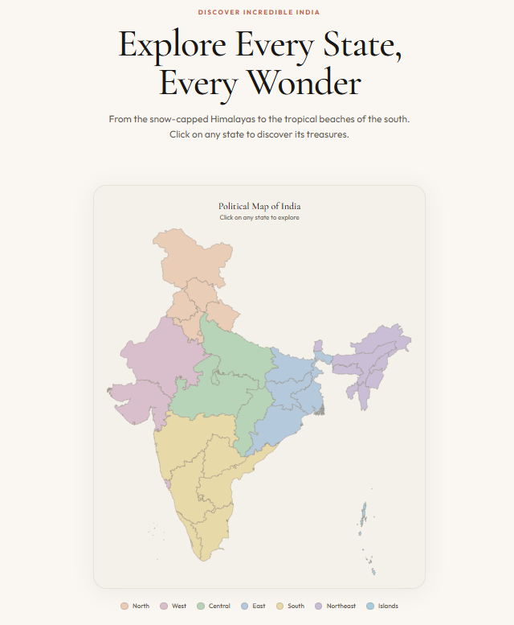

# 🇮🇳 India Explorer

## 🌐 Live Demo

🚀 Deployed Application:  
https://india-explorer-peach.vercel.app

---

# 📸 Project Preview


---

# 🧭 Overview

**India Explorer** is a modern full-stack travel exploration platform designed to digitally showcase the cultural diversity, heritage, architecture, landscapes, and tourism ecosystem of India.

The platform enables users to interactively explore Indian states and tourist destinations through a visually immersive interface powered by dynamic APIs, cloud-hosted databases, and responsive frontend architecture.

Built with a scalable client-server architecture, the application combines a high-performance FastAPI backend, a React-powered frontend, and MongoDB document storage to deliver fast, structured, and dynamic tourism data.

---

# ✨ Core Features

| Feature | Description |
|---|---|
| 🗺️ Interactive State Exploration | Navigate through Indian states dynamically |
| 🏛️ Heritage Destination Showcase | Explore monuments, forts, temples, wildlife & UNESCO sites |
| 🔍 Intelligent Search System | Real-time search across states and destinations |
| 📸 Dynamic Media Rendering | Destination images loaded dynamically |
| ⚡ REST API Architecture | FastAPI-powered backend endpoints |
| 🌐 Full-Stack Integration | Seamless frontend-backend communication |
| 📱 Responsive Design | Optimized for desktop, tablet, and mobile devices |
| 🎨 Modern UI/UX | Clean animations and responsive layouts |
| 🧠 Dynamic Data Fetching | Real-time content rendering using API calls |
| ☁️ Cloud Deployment | Frontend hosted on Vercel, backend deployed on Render |
| 🗃️ MongoDB Integration | NoSQL document-based tourism data management |
| 🔄 API-driven Navigation | Dynamic routing and state-specific rendering |
| 🧭 Categorized Tourism Filtering | Filter destinations based on categories |
| ⚙️ Scalable Architecture | Easily extensible for future AI & map integrations |

---

# 🛠️ Technology Stack

## Frontend Technologies

| Technology | Purpose |
|---|---|
| React.js | Component-based frontend framework |
| React Router DOM | Dynamic routing and navigation |
| Tailwind CSS | Utility-first responsive styling |
| Framer Motion | Advanced UI animations |
| Axios | API communication |
| Lucide React | Icon system |
| CRACO | React configuration customization |

---

## Backend Technologies

| Technology | Purpose |
|---|---|
| FastAPI | High-performance Python backend |
| Uvicorn | ASGI server |
| Python | Backend development |
| Pydantic | Data validation |
| Motor/PyMongo | MongoDB integration |
| REST APIs | Data communication |

---

## Database & Cloud

| Technology | Purpose |
|---|---|
| MongoDB Atlas | Cloud-hosted NoSQL database |
| Vercel | Frontend deployment |
| Render | Backend deployment |
| GitHub | Version control & repository hosting |

---

# 🧠 System Architecture

```text
                    ┌─────────────────────┐
                    │     React Frontend  │
                    │  (Vercel Hosted UI) │
                    └──────────┬──────────┘
                               │
                               ▼
                    ┌─────────────────────┐
                    │    FastAPI Backend  │
                    │   REST API Server   │
                    └──────────┬──────────┘
                               │
                               ▼
                    ┌─────────────────────┐
                    │   MongoDB Atlas DB  │
                    │ Tourism Data Store  │
                    └─────────────────────┘
```

---

# ⚙️ API Architecture

The backend exposes multiple REST endpoints to dynamically serve tourism-related content.

## Sample API Endpoints

```bash
/api/states
/api/search
/api/states/{slug}
/api/categories
```

These APIs provide:
- State metadata
- Destination information
- Search results
- Categorized tourism data
- Dynamic destination rendering

---

# 🚀 Installation & Setup

## 1️⃣ Clone Repository

```bash
git clone https://github.com/marvelayush/india-explorer.git
cd india-explorer
```

---

# 🖥️ Frontend Setup

```bash
cd archive/frontend

npm install

npm run dev
```

Frontend runs on:

```bash
http://localhost:3000
```

---

# ⚙️ Backend Setup

```bash
cd archive/backend

pip install -r requirements.txt

python server.py
```

Backend runs on:

```bash
http://127.0.0.1:8000
```

---

# 🌐 Environment Variables

## Frontend `.env`

```env
REACT_APP_BACKEND_URL=https://your-backend-url.onrender.com
```

---

# 📂 Project Structure

```bash
india-explorer/
│
├── archive/
│   │
│   ├── frontend/
│   │   ├── src/
│   │   ├── public/
│   │   ├── components/
│   │   ├── pages/
│   │   ├── package.json
│   │   └── vercel.json
│   │
│   ├── backend/
│   │   ├── server.py
│   │   ├── requirements.txt
│   │   ├── routes/
│   │   ├── database/
│   │   └── utils/
│
├── homepage.png
├── mainpage.png
└── README.md
```

---

# 🎨 UI & User Experience

The application focuses heavily on immersive UI/UX principles:

- Smooth animations using Framer Motion
- Responsive mobile-first layouts
- Dynamic hover interactions
- Interactive tourism discovery
- Minimalistic modern design language
- Elegant typography & spacing systems

---

# 📊 Key Technical Highlights

✅ Full-stack production deployment  
✅ RESTful API integration  
✅ Dynamic route rendering  
✅ MongoDB document architecture  
✅ Cloud-hosted backend & frontend  
✅ Real-time data fetching  
✅ Responsive frontend engineering  
✅ Component-driven React architecture  
✅ API-based tourism search engine  
✅ Asynchronous backend communication  
✅ Scalable NoSQL database structure  

---

# 🌟 Planned Future Enhancements

| Feature | Status |
|---|---|
| 🤖 AI-based Travel Recommendations | 🔜 Planned |
| 🗺️ Google Maps Integration | 🔜 Planned |
| 🌦️ Weather Forecast API | 🔜 Planned |
| ❤️ User Favorites System | 🔜 Planned |
| 👤 User Authentication | 🔜 Planned |
| 🧭 Personalized Itinerary Generator | 🔜 Planned |
| 📍 Geolocation Support | 🔜 Planned |
| 🧠 AI Chatbot Travel Assistant | 🔜 Planned |
| 🎥 Virtual Tourism Experience | 🔜 Planned |

---

# 📸 Additional Preview



---

# 👨‍💻 Developer

## Ayush Narayan

BTech ISE Student  
Full-Stack Developer  
Python • React • FastAPI • MongoDB

---

# 📜 License

This project is developed for educational, portfolio, and full-stack development purposes.

---

# ⭐ Support

If you like this project:

⭐ Star the repository  
🍴 Fork the project  
🚀 Contribute to future improvements

---
